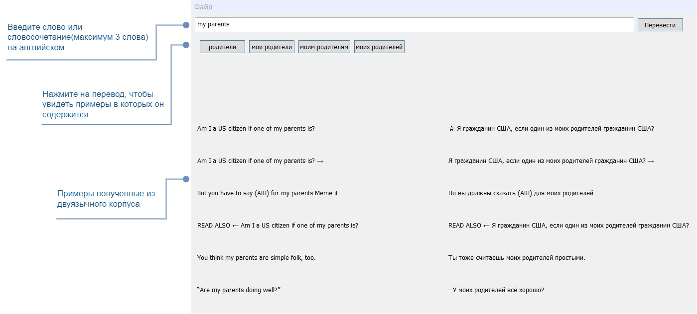

# eng-to-rus-translator
---

Этот проект является приложением для статистического машинного перевода с английского на русский. Приложение создано с использованием Qt Framework. Для поиска переводов используется двуязычный корпус текстов, созданный на основе объединенной базы данных параллельных корпусов [OPUS](https://opus.nlpl.eu/).

## Начало работы и рекомендации
---

Откройте проект в Qt Creator.

Для работы с переводчиком скачайте файл базы переводов по [ссылке](https://drive.google.com/file/d/15FvX6yg-GpkcJ_HaabBMRQwuYDZ6LLz9/view?usp=share_link) и поместите его в каталог сборки проекта.

Использование переводчика:



Для пополнения базы переводов:

* Cкачайте архивы с файлами двуязычного параллельного корпуса по [ссылке](https://drive.google.com/file/d/1cFJC5qbw8SilW9KcPH46s8USDMknfpwk/view?usp=share_link).(Вес архива ~3Гб).

* Пропишите пути до файлов в mainwindow.cpp:

```
void MainWindow::translationSearch(QStringList translationless3Grams,
                                   QStringList translationless2Grams,
                                   QStringList translationless1Grams,
                                   QMap<QString, int>& ngramCountMap,
                                   QMultiMap<QString, QString>& eng3GramRusSentence,
                                   QMultiMap<QString, QString>& eng2GramRusSentence,
                                   QMultiMap<QString, QString>& eng1GramRusSentence)             
{
	...
	QFile* corporaFile = new QFile("");    // Пропишите путь до файла corp1.txt здесь
	...
}
```

```
void MainWindow::backTranslationSearch(QMultiMap<QString, QMap<QString, QVector<int>>> &sourseTranslationSorted)
{
	...
	QFile* corporaFile = new QFile("");    // Пропишите путь до файла corp2.txt здесь
	...
}
```

```
void MainWindow::examplesSearch(QVector <sourse_translation_examples>& setVec)
{
	...
	QFile* corporaFile = new QFile("");    // Пропишите путь до файла corp2.txt здесь
	...
}
```

* Запишите в файл resourсe/learnFile.txt слово, словосочетание или предложение для поиска переводов.
 
* Запустите поиск:


Файлы __dbfacade.h__ и __dbfacade.cpp__ представляют собой интерфейс базы переводов.

Файлы __dynamicbutton.h__ и __dynamicbutton.cpp__ реализуют динамическое создание кнопок с переводами.

Файлы __mainwindow.h__ и __mainwindow.cpp__ реализуют алгоритм поиска переводов и интерфейс системы.